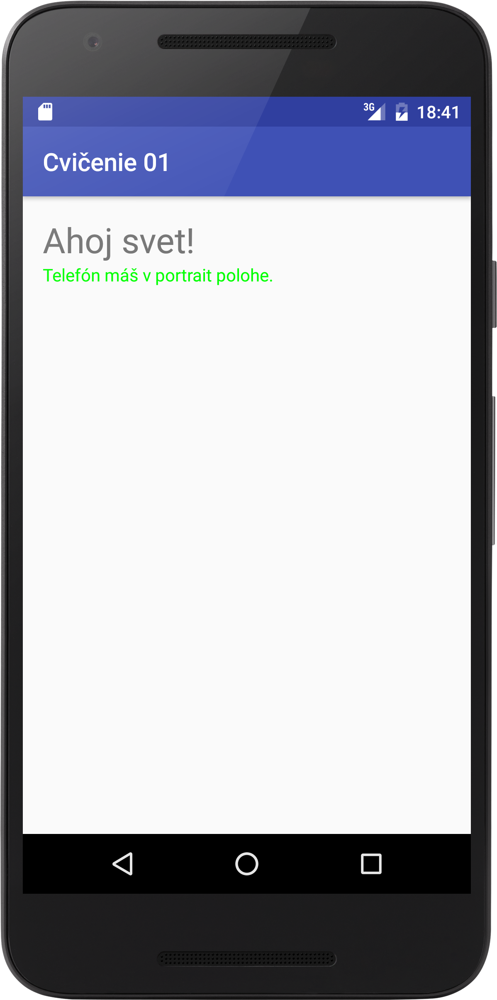
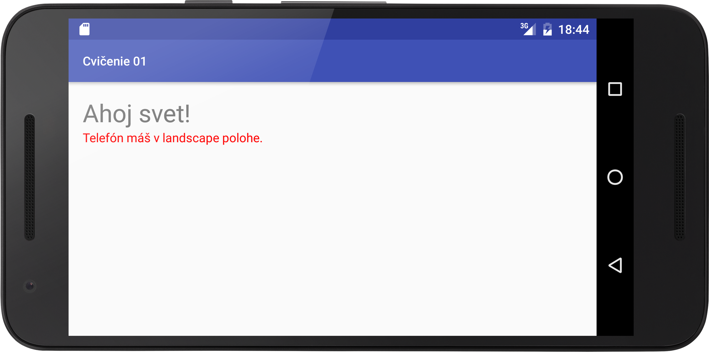

# First exercise

Making different variants of app depending on `res` folder.

## Localization

Create new folder `res/values-<lang>` and file `stings.xml` with translated strings. It will be used when you will run app on phone with specific lang. If you use string which hasn't translated version, default value from `res/values/strings.xml` will be used.

## Different layout for different orientation

Create new folder `res/layout-land` and file `activity_main.xml` for your main activity. It will be used when you will run app in landscape mode.

## Screenshots

### EN localization, portrait

### EN localization, landscape

### SK localization, portrait

### SK localization, landscape

