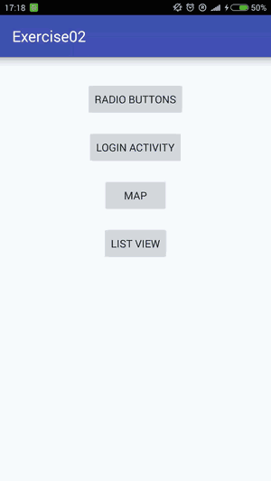
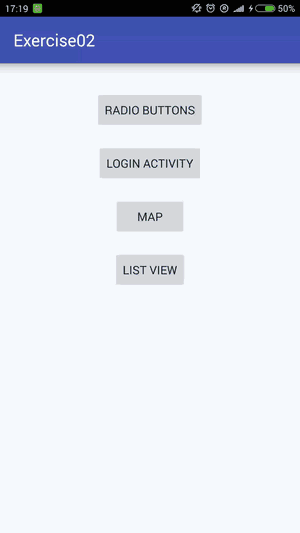

# No.2 exercises

## ListView with custom ArrayAdapter
Creating new `listViewExample.ListViewActivity` Activity which is associated with `layout/activity_list_view.xml`. There is created ListView and custom `listViewExample.PhoneArrayAdapter` Adapter which uses `layout/rowlayout.xml` for rendering single row. There is also created another Activity for display detail of each item, `listViewExample.PhoneDetailActivity`.

## Login form with AutoCompleteTextView
Creating AutoCompleteTextView and adapter for feeding values for this AutoCompleteTextView, Related files are `exercise02.LoginActivity` and `layout/activity_login.xml`.

## Creating implicit Intent to open map app
Related files are `exercise02.MapActivity` and `layout/activity_map.xml`.

## Simple RadioGroup 

