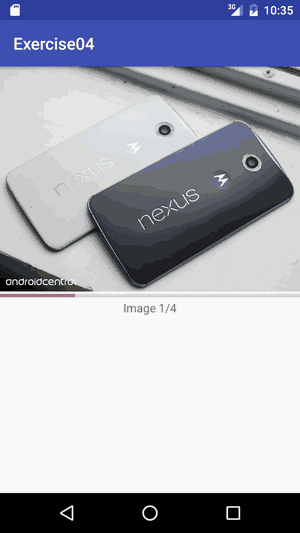

# No.4 exercise - Async load images from internet

This exercise teaches you to implement ImageView into your application. Application load images from the internet. A new image will be loaded with touch events (swipe left or right in activity). 

## Async load images from internet

