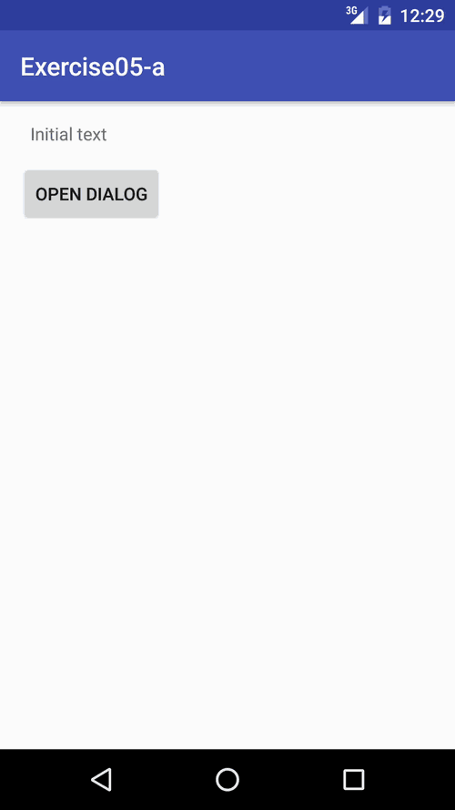

# No.5 exercise - Saving and restoring state

Create	a	new	project, which	ask	a	text	from	the	user	with	Custom	Dialog.	Show	
text	in	TextView.	Rotate	Emulator	or	Device	and	look	what	happens	to	your	text	
in	TextView.

## Saving and restoring state
